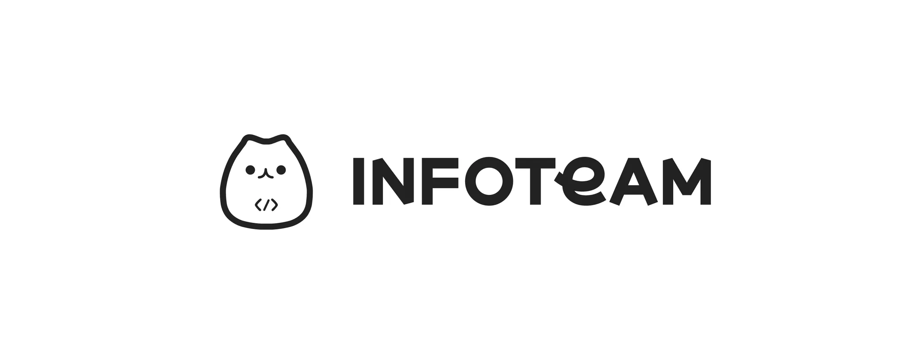
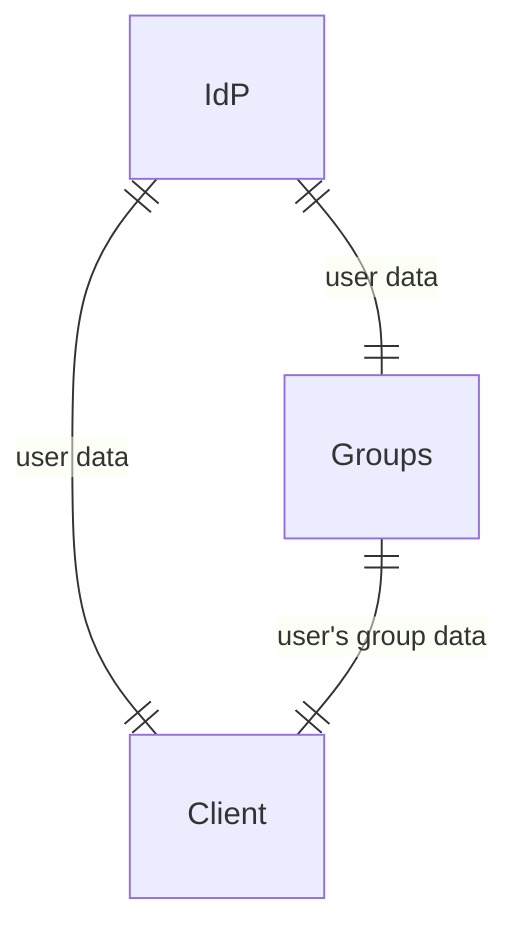
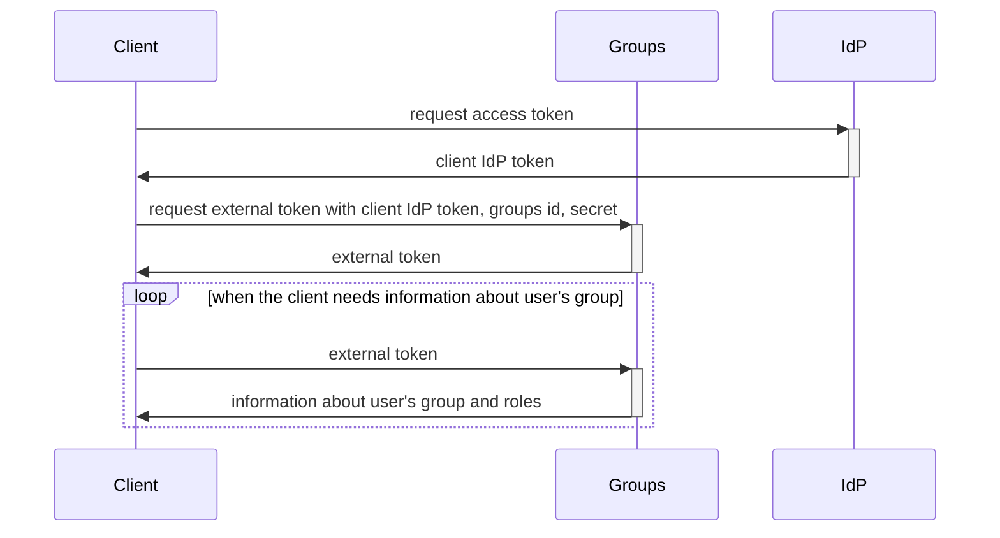

  

# Groups

## Purpose

GIST에 동아리와 같은 그룹을 만들고, 인원을 관리하는 시스템을 만들기 위한 API server이다.  
infoteam만 사용하는 것이 아니라 infoteam이 인증한 다른 서버가 사용하여 그룹에 관련된 정보를 공유할 수 있도록 하였다.  

## Caution

사람의 식별은 IDP의 access token으로 진행한다. 즉, 기본적으로 모든 인원이 IDP를 사용한다는 전제로 개발되었다. 따라서, 본 서비스를 이용하는 또한 IdP에서 인증이 된 서버이여야 할 것이다.  
group들의 정보는 민감한 정보일 수 있기 때문에 infoteam이 인증한 서버이여야 하고 관련된 인증정보를 제시하야만 groups에서 데이터를 얻어낼 수 있다.

## Clarify

### 각 주체들의 명칭 정리

본 문서에서 다루는 주체는 하나가 아닌 여러 개가 존재한다.  
따라서 이들을 정리할 필요가 있다.  
먼저, 본 프로젝트는 groups라고 명명한다. 또한 [Infoteam-IdP](https://github.com/gsainfoteam/idp-be)는 IdP라고 명명한다. 마지막으로, 이 프로젝트를 이용하여 다른 기능을 제공하는 주체를 client 라고 명명한다.

### 각 주체들 사이의 관계

IdP는 모든 서버에서 유저의 신원을 확인하기 위해서 사용된다. 따라서 Groups와 Client서버 모두 IdP를 이용해서 유저를 확인한다.  
Groups는 말그대로, user가 들어가 있는 group과 그 group에서의 role을 검증하는 역할만 한다. 따라서 Groups와 Client 사이에는 user에 대한 데이터는 전달이 되지 않고, 오직 group에 관한 데이터면 전달된다.

### 프로젝트에서 사용되는 Token에 관한 정리

본 프로젝트에서는 IdP에서 발급하는 access token를 IdP token, groups에서 사용자가 포함되어 있는 그룹을 인증하기 위한 token을 external token이라고 명명한다.  
이때, IdP token를 발급하는 주체에 따라서 groups에서 발급한 token을 groups IdP token, client 에서 발급한 token을 client IdP token이라고 한다.

따라서 본 프로젝트에서는 groups IdP token, client IdP token, external token 총 3개의 토큰이 다루어진다.  
하지만, client를 구분하지 않는 IdP token의 특성 상, client IdP token과 group IdP token은 동일한 역할을 한다는 것에 유의하자.  

### External token을 발급받는 과정

위의 sequenceDiagram은 /external endpoint에서 일어나는 일을 도식화한 것이다. Client는 Groups서비스를 이용할 떄, 오직 /external endpoint만을 사용한다는 것을 주의하자. 나머지 group을 관리하는 것은 groups의 서비스를 사용자가 이용해서 관리를 하는 것이므로, client가 관여하지 않는다.  
따라서 client는 오직 user가 속해있는 group과 그 group 속에서 user의 role을 알 수 있다. 이외의 정보는 client에게 제공되지 않는다.

## API DOCS

API docs는 swagger로 구현이 되었으며, 각 문서는 아래의 페이지에서 확인할 수 있다.

prod: <https://api.groups.gistory.me/api>  
stg: <https://api.stg.groups.gistory.me/api>

## DataBase Structure

ERD: <https://dbdocs.io/INFOTEAM%20GIST/groups>
