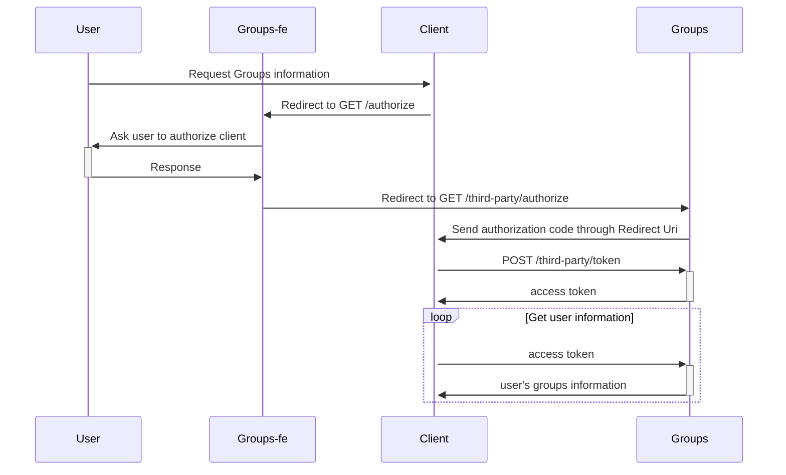

# Third Party Module

This module is for authorize the third party service (Client) and the user, then give the user's groups information to third party service.  
To Authorize the third party service and the user, we use the 'third-party token'. The flow of issuing the third-part token is below.

